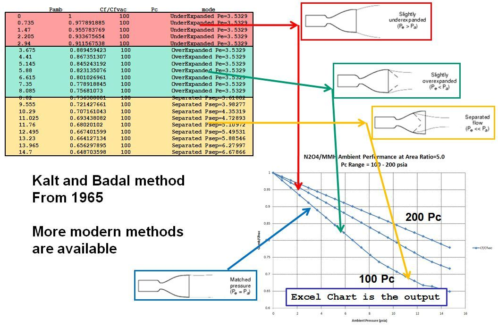

.. ambient_isp

.. _`amb_isp_link`:

Ambient Isp
===========

IspAmb Equation
---------------

The standard CEA output includes two values of Isp::

    Ivac = Isp at vacuum
    Isp  = Isp at ambient pressure equal to nozzle exit pressure

Neglecting nozzle flow separation, the equation for calculating Isp at any ambient pressure (Pamb) is::

    IspAmb = Isp - Cstar * Pamb * eps / Pc / 32.174

This can be verified on the  :ref:`LOX/LH2 Performance <example_1_link>` example of the Standard Examples page::

     Ae/At                     1.00000   40.000
     CSTAR, FT/SEC              7560.0   7560.0
     CF                         0.6572   1.8351
     Ivac,LB-SEC/LB              289.8    451.7
     Isp, LB-SEC/LB              154.4    431.2

where::

    IspAmb = 431.2 = 451.7 - 7560 * 2.17838 * 40 / 1000 / 32.174

Estimate IspAmb
---------------

RocketCEA includes a method for calculating ambient Isp.
The **estimate_Ambient_Isp** method is called as follows::

    IspSL, mode = ispObj.estimate_Ambient_Isp(Pc=500, MR=2.2, eps=50.0, Pamb=14.7)

The example above is for sea level performance where Pamb=14.7 psia.
The returned Isp value considers both ambient pressure correction and potential nozzle flow separation.

The returned **mode** parameter is a string describing the nozzle flow condition.
The script below demonstrates.

.. literalinclude:: ./_static/example_scripts/show_amb_mode.py

The output from the script::

    Pc= 500  eps=  2  IspAmb/IspVac= 329.49/343.22  Mode= UnderExpanded Pe=65.7213
    Pc= 500  eps=  5  IspAmb/IspVac= 354.82/389.09  Mode= UnderExpanded Pe=18.3402
    Pc= 500  eps=  7  IspAmb/IspVac= 354.32/402.22  Mode= OverExpanded Pe=11.8242
    Pc= 500  eps= 10  IspAmb/IspVac= 346.25/414.56  Mode= OverExpanded Pe=7.49482
    Pc= 500  eps= 20  IspAmb/IspVac= 316.16/434.70  Mode= Separated Psep=4.84056, epsSep=14.2
    Pc= 500  eps= 50  IspAmb/IspVac= 309.31/455.27  Mode= Separated Psep=4.84056, epsSep=14.2

Thrust Coefficient
------------------

The thrust coefficient (Cf) is normally defined based on the ambient delivered thrust as::

    Cf = Famb / (Pc * At)
    
    where: Famb=ambient thrust, Pc=chamber pressure, At=throat area

CF is the name given to the thrust coefficient in the CEA output.
(shown above in the :ref:`Ambient Isp <amb_isp_link>` section)

When calculating CF, CEA assumes that the ambient pressure is equal to the nozzle exit pressure.
(displayed as ``P, ATM`` or ``P, BAR`` in the CEA output)

This may not be the Cf of interest since
it is much more common to want the Cf in vacuum or at sea level.

RocketCEA (as of version 1.1.4) provides two methods to obtain a thrust coefficient at any given ambient pressure;
``get_PambCf`` and ``getFrozen_PambCf``. 

These routines return three parameters::

    CF - the value printed out by CEA
    CFamb - the value calculated by RocketCEA for the given ambient pressure
    mode - a description of the nozzle operating conditions at ambient pressure

The following script calls ``get_PambCf`` for the four nozzle operating domains of interest,
under-expanded, Pexit equals Pambient, over-expanded and separated flow.

.. literalinclude:: ./_static/example_scripts/ambient_Cf.py

The output of which is::

    eps=      4, CFcea= 1.4319, CFamb=1.56337, mode=UnderExpanded (Pe=47.5806)
    eps=9.47259, CFcea=1.62334, CFamb=1.62333, mode=Pexit = 14.7034
    eps=     12, CFcea=1.66568, CFamb=1.61783, mode=OverExpanded (Pe=10.7148)
    eps=     40, CFcea=1.78854, CFamb=1.45502, mode=Separated (Psep=4.21395, epsSep=27.3156)

Nozzle Flow Separation
----------------------

The IspAmb equation above neglects the fact that, as ambient pressure rises, eventually the nozzle flow separates.
Flow separation can be quite violent and, in fact, can be the major structural design criteria of engines designed for it.

The :ref:`Parasol Example <parasol_example_link>` page devotes a more detailed exploration of ambient performance and 
flow separation.

The following RocketCEA script runs nozzle separation calculations and launches Microsoft Excel in order to 
plot the results. (works on Windows only, see: `ODSCharts <http://odscharts.readthedocs.io/en/latest/>`_ for a Linux solution.)

.. literalinclude:: ./_static/example_scripts/xl_nozsep.py

The script creates an Excel spreadsheet of ambient performance calculations shown in the image below.
A table of nozzle conditions is shown in the upper left corner of the image.
A graph of ambient pressure vs nozzle Cf ambient divided by Cf vacuum is 
shown in the bottom right corner of the image:

.. note::

    There are more modern methods of estimating flow separation than Kalt and Badal from 1965.
    
    Any detailed engine design that needs to consider flow separation would need to employ improved methods.
    

