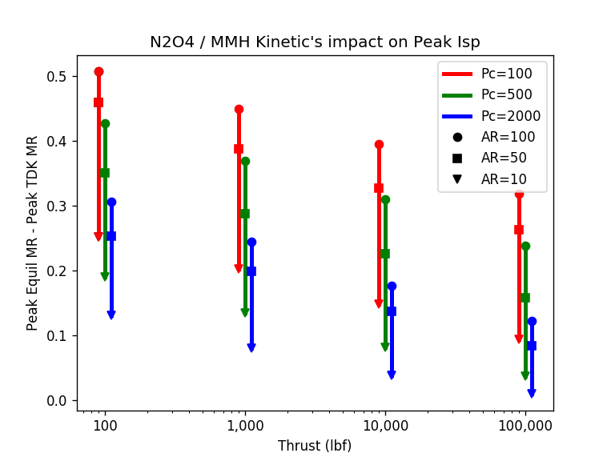

.. engine_mr

.. _`engine_mr_link`:

Engine Mixture Ratio
====================

There are many considerations when choosing the mixture ratio (MR) for a liquid rocket engine design.

The most simplistic (oversimplified) approach is to pick the MR at which CEA predicts 
maximum Isp for the given chamber pressure (Pc) and area ratio (AR) of the propellant combination.

Real engines normally operate at a lower MR than CEA predicts for peak Isp (`LOX/LH2 being the major exception`).
Mechanisms that lower an engines MR include: fuel film cooling, fuel rich bleed cycle engines and chemical kinetics.

Chemical Kinetics
-----------------

CEA is a one dimensional equilibrium (ODE) code.
It calculates temperature, pressure and species concentrations based on a one dimensional flow model
where all molecular species are kept at chemical equilibrium (ODE).

While equilibrium is the most common mode in which to run CEA (and RocketCEA)
both can also run the rocket analysis assuming that the species concentrations are held 
constant (frozen) from the combustion chamber to the nozzle exit.

Real rocket engines operate somewhere between frozen and equilibrium and will therefore
have maximum Isp at a mixture ratio somewhere between the frozen peak and the ODE peak.

This is the case because chemical reactions take a finite amount of time to reach equilibrium.
Given no time, the species are frozen, given infinite time the species reach equilibrium.

In the engine, equilibrium is aided by high pressures (faster reactions/more molecular collisions) 
and species residence time (physical size).
An infinitely small engine has frozen chemistry.
An infinitely large engine has equilibrium chemistry.

The images below compare N2O4/MMH performance for equilibrium, 1-D kinetics and frozen assumptions.
The 1-D kinetics curve is a best estimate of the ideal engine performance without any losses.
The left image is a small, low pressure, large area ratio engine that operates closer to frozen performance.
The right image is a large, high pressure, small area ratio engine that operates closer to equilibrium performance.

    
.. image:: ./_static/odekf_N2O4_MMH_Fvac100_Pc100_eps100.png
    :width: 49%
.. image:: ./_static/odekf_N2O4_MMH_Fvac100000_Pc2000_eps10.png
    :width: 49%
    
`Click Image to View Fill Size`

In the absence of a detailed engine performance analysis, 
for initial sizing, pick a mixture ratio somewhere between the frozen and ODE peaks
for the engine's core flow.

A summary specific to N2O4/MMH is shown below.
It is a rough guide for choosing where the real peak N2O4/MMH mixture ratio will occur.

The chart on the lower left shows the mixture ratio where peak ODK Isp occurs as a function of 
thrust, Pc and area ratio. 
The chart on the right shows how the peak ODK MR differs from the peak MR predicted by CEA.
(This is no substitute for a real JANNAF standard analysis, but is a good quick estimate.)

Note that fuel film cooling is very common in N2O4/MMH engines and
will lower the thrust chamber MR below the core MR.

.. image:: ./_static/N2O4_MMH_Peak_ODK_MR.png
    :width: 49%

`Click Image to View Fill Size`

LOX/RP1 GG vs SC
----------------

LOX/RP1 is mostly used in large engines of > 100 Klbf.
The chemical kinetics impact on performance is very small as shown below.
Moderate Pc with small area ratio nozzles have virtually no impact on mixture ratio selection.
At high Pc, even large area ratios have very little impact on mixture ratio selection.

Note that both images below are for 100 Klbf engines.

.. image:: ./_static/odekf_LOX_RP1_Fvac100000_Pc1000_eps10.png
    :width: 49%
.. image:: ./_static/odekf_LOX_RP1_Fvac100000_Pc2000_eps100.png
    :width: 49%
    
`Click Image to View Fill Size`

.. image:: ./_static/LOX_RP1_Peak_ODK_MR.png
    :width: 49%
.. image:: ./_static/LOX_RP1_Peak_MR_Shift.png
    :width: 49%

With LOX/RP1 engines, it is helpful to look at historical MR selections.
Staged combustion (SC) designs use MR values very close to the ODK predictions (~2.6), very near CEA predictions.
Fuel rich gas generator cycles (GG) are significantly lower MR than CEA predicts (~2.0 to 2.2).

In LOX/RP1 fuel rich GG cycle engines, the thrust chamber is typically very near the MR of 2.6.
It is the fuel rich flow through the gas generator that reduces the overall engine mixture ratio.

LOX/LH2 Bulk Density
--------------------

LOX/LH2 is the exception to the rule that real engines operate at lower mixture ratios than the MR of peak Isp.
LOX/LH2 engines normally operate well above peak Isp (i.e. more oxidizer rich).
A kinetics analysis indicates the MR should be about 4.5 to 5.0, whereas, 
real engines typically operate at an MR of about 5.5 to 6.0

The main incentive for this is that the density of LH2 is so low compared to LOX, that Isp becomes less of a consideration
than the mass of tankage, pressurization system, line sizes, engine injector size, etc.

In other words, the best vehicle performance is not at peak delivered Isp, but at a higher MR.

The image below shows two curves for specific gravity vs. Isp for LOX/LH2.
The upper curve is Isp equilibrium and the lower curve is Isp frozen.
The numbers along the curve indicate the mixture ratio at various points along the sg vs Isp curve.
The real engine curve will be somewhere in between.

Superimposed are lines of constant gross stage initial mass and lines of constant stage delta velocity.
Those lines assume that the full propellant volume of the Centaur upper stage could be filled with 
any mixture ratio of LOX/LH2 without changing the stage inert mass.
(i.e. assume that increasing the cylindrical section of one tank by the same amount that
the other tank is reduced will have little impact on overall inert mass.)

The conclusion is that operating at an MR of 6 can add 10 to 15 percent more delta velocity
to the stage.  Note that the stage initial gross mass also increases so that the overall 
delta velocity benefit to the vehicle will be less than that of this upper stage alone.

.. _`engine_mr_loxlh2_link`:

.. image:: ./_static/example_scripts/rho_veh_LOXLH2.png
    :width: 99%
    
`Click Image to View Fill Size`

    
The charts below show the kind of kinetics effects that can be expected with LOX/LH.

.. image:: ./_static/odekf_LOX_LH2_Fvac100_Pc100_eps100.png
    :width: 49%
.. image:: ./_static/odekf_LOX_LH2_Fvac100000_Pc2000_eps10.png
    :width: 49%
    
`Click Image to View Fill Size`

.. image:: ./_static/LOX_LH2_Peak_ODK_MR.png
    :width: 49%
.. image:: ./_static/LOX_LH2_Peak_MR_Shift.png
    :width: 49%
    
`Click Image to View Fill Size`

    