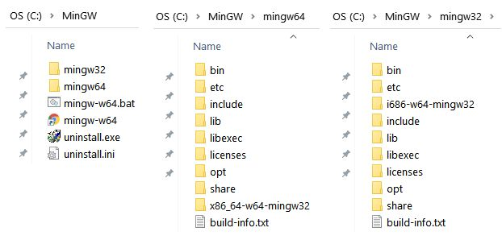
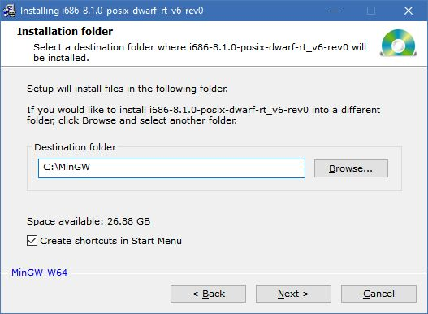
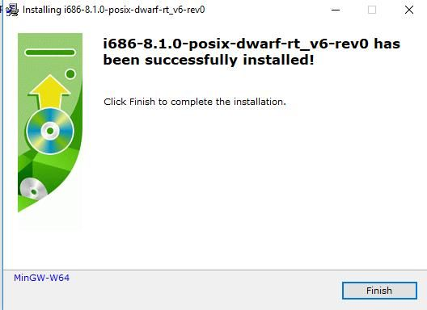
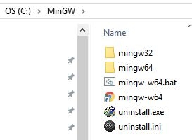

.. installgfortran

.. _link_installgfortran:

Install gfortran
================

To compile and run RocketCEA, users need to install `gfortran <https://www.gnu.org/software/gcc/fortran/>`_ .

Each operating system has its own approach.

Debian/Ubuntu
-------------

The one-liner::

    sudo apt-get install gfortran
    
installs `gfortran <https://www.gnu.org/software/gcc/fortran/>`_ on 
`Debian <https://www.debian.org/>`_/`Ubuntu <https://ubuntu.com/>`_ systems.

CentOS/RHEL
-----------

From my testing on `CentOS <https://www.centos.org/>`_, `gfortran <https://www.gnu.org/software/gcc/fortran/>`_
the commands::

    yum install epel-release
    yum install gcc-gfortran
    
will install `gfortran <https://www.gnu.org/software/gcc/fortran/>`_
(You may need to be logged in as root.)

In order to link with python and use pip, you will also need::

    yum install python-devel
    yum install python-pip
    
    OR
    
    sudo yum install python-devel
    sudo yum install python-pip

.. note::
    
    The error message
    "not finding Python.h during compile."
    indicates that the python devel library is required.

Presumably `RHEL <https://www.redhat.com/en/technologies/linux-platforms/enterprise-linux>`_
will be similar.

OpenSUSE
--------

To install `gfortran <https://www.gnu.org/software/gcc/fortran/>`_ on 
`OpenSUSE <https://www.opensuse.org/>`_ use::

    sudo zypper install gcc gcc-c++ gcc-fortran

Similar to `CentOS <https://www.centos.org/>`_ ,
`OpenSUSE <https://www.opensuse.org/>`_ will need the following
in order to link the compiled FORTRAN to python::

    sudo zypper in python3-devel  # for python3.x installs

.. note::
    
    The error message
    "not finding Python.h during compile."
    indicates that the python devel library is required.

MacOS/OSX
---------

I had trouble using `gfortran <https://www.gnu.org/software/gcc/fortran/>`_ with
python 2.7 on `MacOS Sierra <https://en.wikipedia.org/wiki/MacOS_Sierra>`_, 
however, python 3.7 seemed to work just fine with::

    brew install gcc
    brew install python3
    pip3 install numpy
    pip3 install genericf2py

.. _`link_installmingw`:

Windows 10
----------

.. important::

    Windows users MUST put MinGW into environment PATH variable.
    (see: :ref:`link_windowspath`)
    
    for 32 bit (Untested for versions 1.2.0 and above):
    C:\\MinGW\\mingw32\\bin  AND
    C:\\MinGW\\mingw32\\bin
    
    For 64 bit:
    C:\\MinGW\\mingw64\\lib  AND 
    C:\\MinGW\\mingw64\\lib

`Windows 10 <https://en.wikipedia.org/wiki/Windows_10>`_ is the most complicated platform 
on which to set up `gfortran <https://www.gnu.org/software/gcc/fortran/>`_.

Assuming that your user may need either the 32 or 64 bit compiler, I recommend using the
`SourceForge MinGW-w64 for 32 & 64 bit Windows <https://sourceforge.net/projects/mingw-w64/>`_.

.. note::

    For python 3.8 and above, 32 bit python may not work with RocketCEA on Windows. 
    
    64 bit python is recommended for RocketCEA with python versions 3.8 and above on Windows.

Go to the site `SourceForge MinGW-w64 for 32 & 64 bit Windows <https://sourceforge.net/projects/mingw-w64/>`_.
and download MinGW installer (``mingw-w64-install.exe``). At the time of this writing, the downloaded file is ``mingw-w64-install.exe``.
Run ``mingw-w64-install.exe``.

.. image:: ./_static/mingw_welcome.jpg
    :width: 60%

After clicking ``Next``, the settings screen will appear.  

For 64 bit compilation, the settings that worked for me are shown below.

.. image:: ./_static/mingw64_install.jpg
    :width: 60%

For 32 bit compilation, these were my settings.

.. image:: ./_static/mingw32_install.jpg
    :width: 60%
    
A location for the MinGW install then needs to be selected. The default location is in 
C:\\Program Files (x86)\\mingw-w64\\... etc.  However I recommend a simpler path like **C:\\MinGW**
so that, later on, setting the user's environment PATH will be easier.

After several minutes of an ``Installing Files`` you should arrive at a successful finish screen.

.. image:: ./_static/mingw_installing_files.jpg
    :width: 45%

When both 32 and 64 bit compilers are installed, and if you selected **C:\\MinGW** as your install directory.
You should have a **C:\\MinGW** directory that looks like the one below. 
(Recall that only 64 bit is recommended for RocketCEA)

.. _link_windowspath:

Windows PATH
~~~~~~~~~~~~

.. important::

    Windows users MUST put 2 MinGW paths into environment PATH variable.
    
    C:\\MinGW\\mingw64\\bin  and
    
    C:\\MinGW\\mingw64\\lib
    
    OR
    
    C:\\MinGW\\mingw32\\bin  and
    
    C:\\MinGW\\mingw32\\lib

Having installed `gfortran <https://www.gnu.org/software/gcc/fortran/>`_ , 
there are some options as to when and how to change the system's PATH environment variable.

For 32 bit compilation, the following must be in the PATH::

    C:\MinGW\mingw32\bin;
    C:\MinGW\mingw32\lib;

for 64 bit compilation::

    C:\MinGW\mingw64\bin;
    C:\MinGW\mingw64\lib;

These can be added as-needed, for example::

    set PATH=C:\MinGW\mingw32\bin;C:\MinGW\mingw32\lib;%PATH%
      OR
    set PATH=C:\MinGW\mingw64\bin;C:\MinGW\mingw64\lib;%PATH%

They can also be added by editing the system Environment Variables in the Control Panel.

Search for "environment variables" in the Windows 10 Search box and click on "Control Panel"

Once there, select "Environment Variables...".

.. image:: ./_static/search_env_vars_lhs.jpg
    :width: 40%

.. image:: ./_static/control_panel.jpg
    :width: 55%

The "Environment Variables..." Button will result in the screen below where either the 
System or User Variables can be edited.

.. image:: ./_static/path_env_var.jpg

Add the **C:\\MinGW** path for **Either** the 32 or 64 bit compiler.

.. image:: ./_static/new_env_var.jpg

.. important::

    Windows users MUST put MinGW into environment PATH variable.
    (see: :ref:`link_windowspath`)
    
    C:\MinGW\mingw64\bin  OR  C:\MinGW\mingw32\bin
    
    and
    
    C:\MinGW\mingw64\lib  OR  C:\MinGW\mingw32\lib

