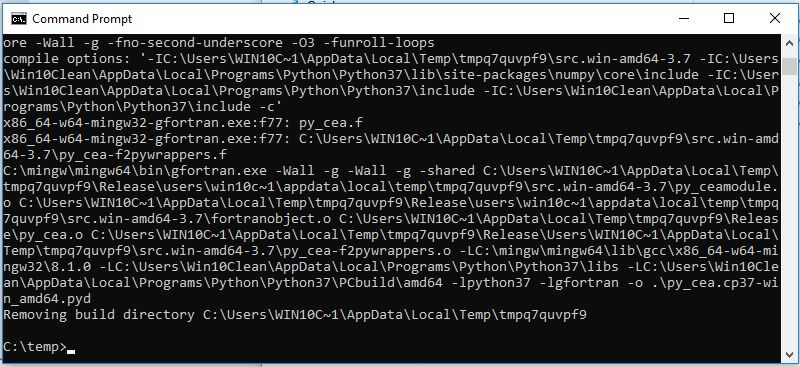
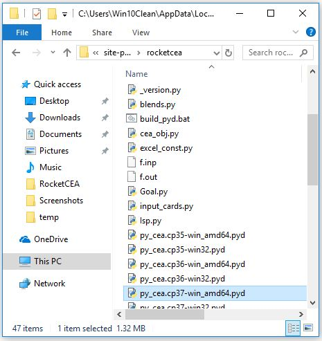

.. quickstart

QuickStart
==========

Install RocketCEA
-----------------

The easiest way to install RocketCEA is::

    pip install rocketcea
    
        OR on Linux
    sudo pip install rocketcea
        OR perhaps
    pip install --user rocketcea

Getting Help
------------

After installing with ``pip``, there will be a launch command line program called **rocketcea** or, on Windows, **rocketcea.exe**. 

From a terminal or command prompt window simply type::

    rocketcea

Your browser will launch with these RocketCEA help pages.

Running RocketCEA
-----------------

Any use of RocketCEA begins with an import statement and an instance of CEA_obj::

    from rocketcea.cea_obj import CEA_Obj
    C = CEA_Obj( oxName='LOX', fuelName='LH2')

In the above example, LOX and LH2 are called out, but any propellants on the :ref:`Propellants <propellants_link>` page can be used.

There are a large number of examples included in this document

For instance, look at :ref:`LOX/LH2 Performance <example_1_link>` on the :ref:`Standard Examples <std_examples_link>` page. 

To run an example, highlight the source code with your mouse, right click the highlighted code and select **Copy**. 
Paste that code into your text editor and save it to a python file.(for example D:\\rocketcea\\example_1.py).

    
Example files can be run with the command::

    python example1.py

Or, in many text editors hitting the **F5** key will execute the code.

.. note::
    
    RocketCEA is compiled with the mingw and mingw-w64 gfortran compilers using default f2py options
    giving a "shared" `*.pyd` file that requires mingw libraries at run time.
    
    If you see the error: ``Import Error: DLL load failed: The specified module could not be found``
    You may need to install the MinGW Compiler Suite and perhaps even recompile RocketCEA in order 
    for RocketCEA to work (see below)

Test The Install
----------------

Paste the following code into your text editor and save it to your test folder as basic_cea.py 
(for example, D:\\rocketcea\\basic_cea.py)::

    from rocketcea.cea_obj import CEA_Obj
    C = CEA_Obj( oxName='LOX', fuelName='LH2')
    for mr in range(2,9):
        print(mr, C.get_Isp(Pc=100.0, MR=mr, eps=40.0) )

At the command prompt, give the command::

    python basic_cea.py
    
If you see the following output::

    (2, 424.3597085736007)
    (3, 445.44434236555196)
    (4, 453.13271951921837)
    (5, 453.240429182719)
    (6, 448.190232998362)
    (7, 438.74340042907266)
    (8, 424.6998266323161)

Great... you are good to go.

If not, see the information below.

Install Problems
----------------

RocketCEA makes heavy use of the `NASA CEA FORTRAN code <https://www.grc.nasa.gov/WWW/CEAWeb/ceaHome.htm>`_.
For RocketCEA, the NASA FORTRAN code has been modified and turned into a python module using `f2py <https://docs.scipy.org/doc/numpy/f2py/python-usage.html>`_.

When compiling FORTRAN into a python library, each version of python needs its own compiled library.
The libraries I've provided are::

    Windows python 2.7 32 bit and 64 bit
    Windows python 3.5 32 bit and 64 bit
    Windows python 3.6 32 bit and 64 bit
    Windows python 3.7 32 bit and 64 bit
    
    Ubuntu Linux python 2.7 32 bit and 64 bit
    Ubuntu Linux python 3.5 32 bit and 64 bit
    Ubuntu Linux python 3.6 32 bit and 64 bit

If your version of python is not shown above, or if RocketCEA fails to load the ``py_cea`` module,
you may need to run f2py on the FORTRAN code on your system in order to create ``py_cea.pyd`` or
``py_cea.so`` or some variation thereof.

The source code ``py_cea.f`` is in the install directory of ``rocketcea`` along with a FORTRAN
include file called ``py_cea.inc``. 

Linux ImportError:
------------------

On Linux, the error message ``ImportError: Libgfortran.so.3: cannot open shared object file:`` indicates
that the gfortran libraries were not found.

Begin by installing gfortran::

    sudo apt-get install gfortran
    

Rerun the above test with the command::

    python basic_cea.py

If you get the ImportError again, try installing the same version of Libgfortran 
(Libgfortran.so.3 in the above error message.)::

    sudo apt-get install libgfortran3

The basic_cea.py file should be working now.

Windows DLL load failed:
------------------------

On Windows, the error message ``Import Error: DLL load failed: The specified module could not be found`` indicates
that the MinGW gfortran libraries were not found.

On Windows the procedure is much more involved than on Linux. You will need to download MinGW gfortran,
recompile the NASA CEA code, and place the resulting executable library into the RocketCEA site-packages.

Install MinGW
~~~~~~~~~~~~~

Go to the site `SourceForge MinGW-w64 for 32 and 64 bit Windows <https://sourceforge.net/projects/mingw-w64/>`_.
and download MinGW. At the time of this writing, the downloaded file is ``mingw-w64-install.exe``.
Run mingw-w64-install.exe.

.. image:: ./_static/mingw_welcome.jpg
    :width: 60%

After clicking ``Next``, the settings screen will appear.  The settings that worked for me are shown below.

.. image:: ./_static/mingw_settings.jpg
    :width: 60%

A location for the MinGW install then needs to be selected. The default location is in 
C:\\Program Files (x86)\\mingw-w64\\... etc.  However I recommend a simpler path like C:\\mingw
so that some of the later steps will be easier.

.. image:: ./_static/mingw_path_select.jpg
    :width: 60%

After several minutes of an ``Installing Files`` you should arrive at a successful finish screen.

.. image:: ./_static/mingw_installing_files.jpg
    :width: 45%

.. image:: ./_static/mingw_finished.jpg
    :width: 45%

Set PATH Environment Variable
~~~~~~~~~~~~~~~~~~~~~~~~~~~~~

Make sure that your environment variable `PATH` includes the `bin` subdirectory of MinGW.

Find the ``System Properties`` interface on your machine or perhaps go directly to
`Edit environment variables for your account` and Edit the ``Path`` variable.

.. image:: ./_static/system_props.jpg

.. image:: ./_static/env_vars.jpg

Select ``Edit`` for the ``Path`` variable and then ``New`` to place the ``bin`` subdirectory of MinGW into
your system PATH.

.. image:: ./_static/add_mingw_bin.jpg

If you installed MinGW to C:\\mingw, then the proper path should be::

    C:\mingw\mingw64\bin
    
However, you should verify this using the Windows file explorer.

I recommend that you use file explorer to copy and then paste the ``bin`` directory path
in order to avoid any typing errors.

.. note::

    After entering the new PATH value, close any open command prompt windows and open a new one.
    
    Changes to the PATH only take affect for new window.

Recompile RocketCEA
~~~~~~~~~~~~~~~~~~~

We are now ready to recompile RocketCEA.

I recommend setting up a temporary directory for this, something like C:\\temp.

You will need to locate RocketCEA in the python site-packages (assuming your pip install succeeded).
One way to do that is at the command prompt. Call up the python interpreter, import rocketcea and then 
print the value of rocketcea.__file__.

.. image:: ./_static/find_rocketcea.jpg

Using the Windows file explorer, go to the RocketCEA site-packages subdirectory (discovered above) 
and copy three files to C:\\temp: py_cea.f, py_cea.inc and py_cea.pyf

In addition to those three files, we need to create two Windows BAT files.
Copy the following lines and paste them into a text editor.
Save them to the file names shown.

.. note::

    You will DEFINITELY need to change the PYTHON_LIB value to match your python install.
    
    PYTHON_LIB = C:\\Users\\Win10Clean\\AppData\\Local\\Programs\\Python\\Python37\\libs

    You MAY need to change mingw value (C:\\mingw\\mingw64) everywhere it occurs.

``set_env_for_f2py.bat``::

    SET GCC=C:\mingw\mingw64\bin\x86_64-w64-mingw32-gcc.exe
    SET PYTHON_LIB = C:\Users\Win10Clean\AppData\Local\Programs\Python\Python37\libs

    SET LIBRARY_PATH = C:\mingw\mingw64\lib
    SET G95_LIBRARY_PATH = C:\mingw\mingw64\lib

    SET C_INCLUDE_PATH=C:\mingw\mingw64\include

    SET CC=gcc python setup.py build

.. note::

    You MAY need to change mingw value C:\\mingw\\mingw64

``run_f2py.bat``::

    python.exe -m numpy.f2py -c py_cea.pyf py_cea.f  --compiler=mingw32 --f77exec=C:\mingw\mingw64\bin\x86_64-w64-mingw32-gfortran.exe

When you have done all of the above, you should have a directory that looks like the following.

.. image:: ./_static/ready_to_compile.jpg

Using a command prompt, navigate to C:\\temp and enter the command::

    set_env_for_f2py.bat

You should see a number of environment variables set 

.. image:: ./_static/set_env_for_f2py.jpg

Cross Your Fingers
~~~~~~~~~~~~~~~~~~

Now cross your fingers and enter the command::

    run_f2py.bat
    
With any luck, the long series of output will end as shown below

The resulting ``pyd`` file should now be in C:\\temp as shown below.
In this case it is ``py_cea.cp37-win_amd64.pyd``

.. image:: ./_static/post_compile_dir.jpg

A possible compile error is 
``TypeError: '>=' not supported between instances of 'NoneType' and 'str'``

.. image:: ./_static/bad_mingw_path.jpg

If you have this error, go to `MinGW PATH Error`_.

Move pyd Into RocketCEA
~~~~~~~~~~~~~~~~~~~~~~~

Now that all the hard work is done, the final step is to move the resulting ``pyd`` file 
into the RocketCEA site-packages.

Use Windows file explorer to right click on the ``pyd`` file 
(``py_cea.cp37-win_amd64.pyd`` in the example above)
and select ``Copy``.

Navigate to the path that you located by printing the rocketcea.__file__ parameter
and paste the file into the rocketcea subdirectory. ``(EXCEPT for Python 2.7 64 bit,  SEE BELOW)``

You will likely be prompted to replace or skip the operation.  Choose ``Replace``.

.. image:: ./_static/replace_old_pyd.jpg

That subdirectory will now look something like the following.

.. note::

    Python 2.7 64 bit should be pasted below rocketcea at rocketcea\\py27_64

.. image:: ./_static/py27_64bit_location.jpg

Re-Test RocketCEA
~~~~~~~~~~~~~~~~~

Go back to `Test The Install`_ and run the test.

MinGW PATH Error
~~~~~~~~~~~~~~~~

A possible compile error is 
``TypeError: '>=' not supported between instances of 'NoneType' and 'str'``

.. image:: ./_static/bad_mingw_path.jpg

This occurs when the various path entries to the MinGW libraries in the two batch files are incorrect, OR,
when the PATH to MinGW in the environment variables is wrong or not entered.

It can also occur if you use a command prompt window that was already open when you entered the PATH
environment variable or if you entered the PATH data incorrectly.

In ``set_env_for_f2py.bat``, double check your values for GCC, LIBRARY_PATH, G95_LIBRARY_PATH, C_INCLUDE_PATH

Use file explorer to go to the MinGW bin directory and copy the path directly from file explore and paste it directly
into ``set_env_for_f2py.bat`` in order to avoid any typing errors.

Do the same with ``run_f2py.bat``. Copy and paste the full path to the gfortran executable
(it will look similar to ``C:\mingw\mingw64\bin\x86_64-w64-mingw32-gfortran.exe``
BUT MIGHT BE DIFFERENT ON YOUR SETUP)

Finally, go back and verify the PATH environment variable in `Set PATH Environment Variable`_.
Again copy and paste the path and again close any open command prompt windows.

You should now be ready for another compile attempt at `Cross Your Fingers`_.

Windows Issues
--------------

Commands like::

    pip install rocketcea
    pip3.6 install rocketcea
    
should just work on Windows.

So far, the main issue I've had on a Windows platform is when python is installed in a directory
with a space in the name.  Any directories like ``C:/Python27`` or ``C:/Python37`` should work fine.

Another issue is with python 3.7 64 bit.
At the time of this writing, matplotlib was not properly installing.
I made matplotlib a dependency of RocketCEA and I assume that python 3.7 will have working support for 
matplotlib soon.

Ubuntu Linux Issues
-------------------

Commands like::

    pip install rocketcea
    pip3 install rocketcea
    
may well fail with any number of messages.

The most common problems can be solved by first installing dependencies like the following.::

    sudo apt-get install python-pip
    sudo apt-get install python-matplotlib
    sudo apt-get install python-tkinter

    OR

    sudo apt-get install python3-pip
    sudo apt-get install python3-matplotlib
    sudo apt-get install python3-tkinter

    AND PERHAPS

    sudo apt-get install libfreetype6-dev
    sudo apt-get install pkg-config
    sudo apt-get install libgfortran3:i386
    sudo pip install cairocffi
    sudo apt-get install python-gi-cairo

